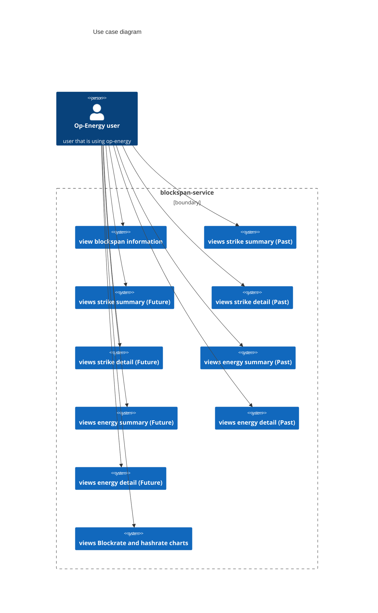
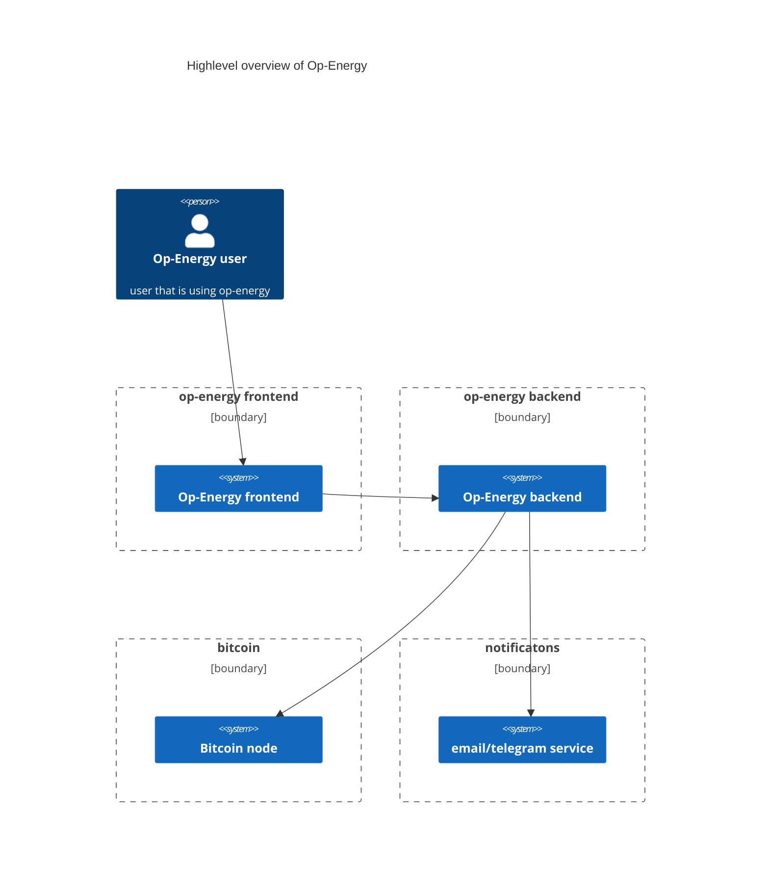
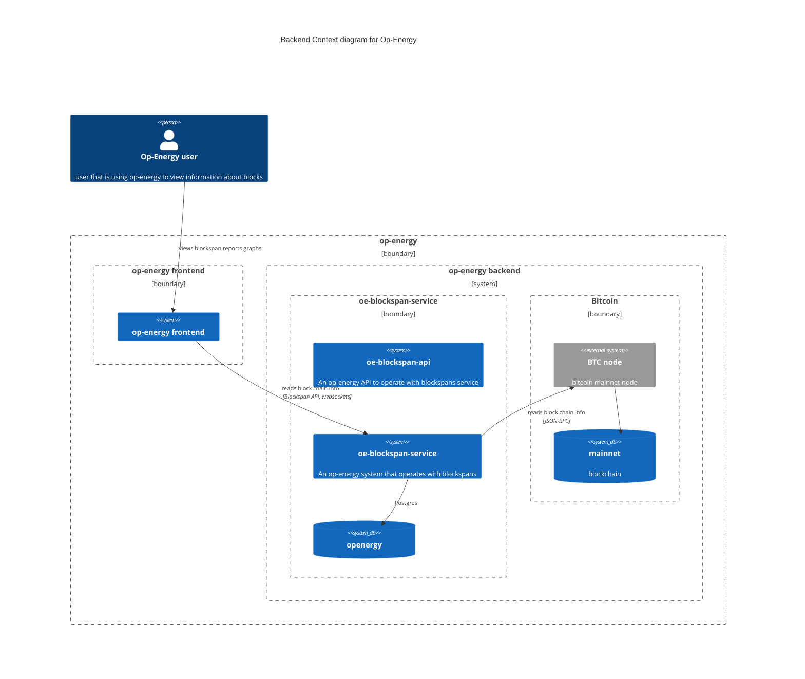
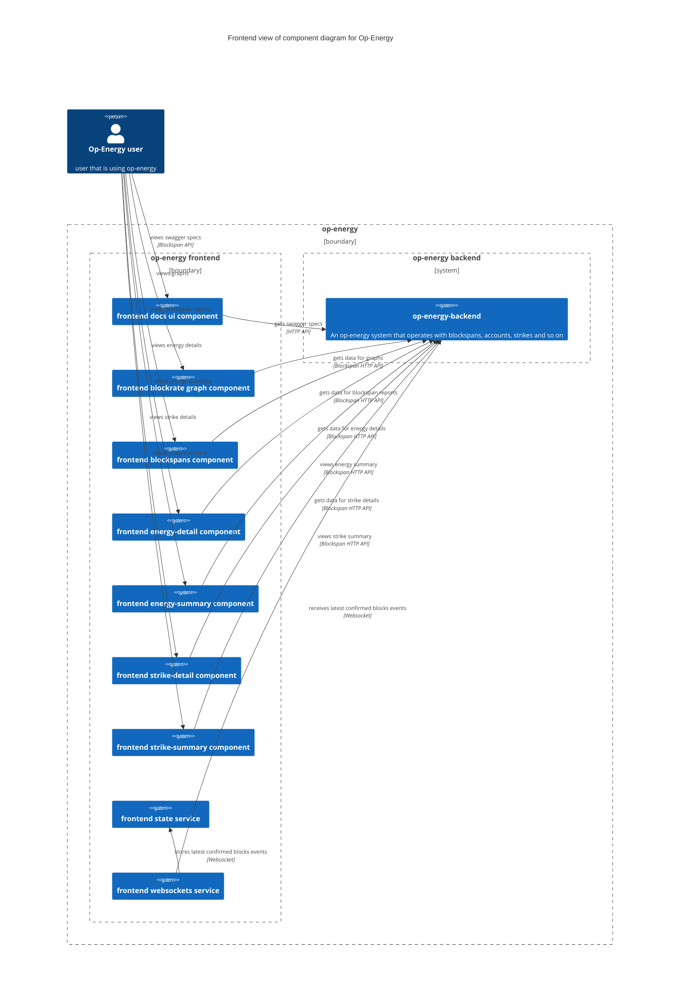

# Brief

This repo contains blockspan service and frontend of the Op-Energy.

Historically, `op-energy` consists from 2 repos: `op-energy-blockspan-service`
(initial one) and `op-energy` (which was private until some point of time). Be
aware that current document covers only `op-energy-blockspan-service`.
`op-energy`'s documentation, in it's turn, covers both both (at least in terms
of installation and building).

See https://github.com/op-energy-foundation/op-energy/ for the reference in case
if your goal is to build/setup a complete op-energy setup.

# Installation

We use nix package manager for deployment. Our primary target is NixOS, but you can use nix to build OpEnergy on any OS supporting Nix and then setup OS-specific system services yourself.

## How to install on NixOS

As NixOS is our primary target, you just need to:

1. clone op-energy blockspan service repo:

```
sudo -i
mkdir -p /etc/nixos/overlays
git clone https://github.com/op-energy-foundation/op-energy-blockspan-service --recursive /etc/nixos/overlays/op-energy-blockspan-service
```

2. generate random secrets with

```
sudo -i
mkdir -p /etc/nixos/private
cd /etc/nixos/overlays/op-energy-blockspan-service/op-energy-backend/
nix-shell shell.nix
./gen-psk.sh /etc/nixos/private mainnet
exit
```

3. add config to `/etc/nixos/configuration.nix`

```
args@{ pkgs
, lib
, config
, GIT_COMMIT_HASH ? ""
, OP_ENERGY_REPO_LOCATION ? /etc/nixos/.git/modules/overlays/op-energy/modules/oe-blockspan-service
, OP_ENERGY_ACCOUNT_REPO_LOCATION ? /etc/nixos/.git/modules/overlays/op-energy
  # import psk from out-of-git file
, bitcoind-mainnet-rpc-psk ? builtins.readFile ( "/etc/nixos/private/bitcoind-mainnet-rpc-psk.txt")
, bitcoind-mainnet-rpc-pskhmac ? builtins.readFile ( "/etc/nixos/private/bitcoind-mainnet-rpc-pskhmac.txt")
, op-energy-db-psk-mainnet ? builtins.readFile ( "/etc/nixos/private/op-energy-db-psk-mainnet.txt")
, op-energy-db-salt-mainnet ? builtins.readFile ( "/etc/nixos/private/op-energy-db-salt-mainnet.txt")
, ...
}:

let
  GIT_COMMIT_HASH = REPO_LOCATION: if builtins.hasAttr "GIT_COMMIT_HASH" env
    then env.GIT_COMMIT_HASH
    else
      let
        sourceWithGit = pkgs.copyPathToStore REPO_LOCATION;
      in
      builtins.readFile ( # if git commit is empty, then try to get it from git
      pkgs.runCommand "get-rev1" {
        nativeBuildInputs = [ pkgs.git ];
      } ''
        echo "OP_ENERGY_REPO_LOCATION = ${REPO_LOCATION}"
        HASH=$(cat ${sourceWithGit}/HEAD | cut -c 1-8 | tr -d '\n' || printf 'NOT A GIT REPO')
        printf $HASH > $out
      ''
    );
  opEnergyFrontendModule = import ./overlays/op-energy-blockspan-service/frontend/module-frontend.nix { GIT_COMMIT_HASH = GIT_COMMIT_HASH OP_ENERGY_REPO_LOCATION; };
  opEnergyBackendModule = import ./overlays/op-energy-blockspan-service/op-energy-backend/module-backend.nix { GIT_COMMIT_HASH = GIT_COMMIT_HASH OP_ENERGY_REPO_LOCATION; };
in
{
  imports = [
    # custom module for op-energy
    opEnergyFrontendModule
    opEnergyBackendModule
  ];
  # bitcoind mainnet instance
  services.bitcoind.mainnet = {
    enable = true;
    dataDir = "/var/lib/bitcoind-mainnet";
    extraConfig = ''
      txindex = 1
      server=1
      listen=1
      discover=1
      rpcallowip=127.0.0.1
    '';
    rpc.users = {
      op-energy = {
        name = "op-energy";
        passwordHMAC = "${bitcoind-mainnet-rpc-pskhmac}";
      };
    };
  };

  # op-energy part
  services.op-energy-backend = {
    mainnet =
      let
        db = "openergy";
      in {
      db_user = "openergy";
      db_name = db;
      db_psk = op-energy-db-psk-mainnet;
      config = ''
        {
          "DB_PORT": 5432,
          "DB_HOST": "127.0.0.1",
          "DB_USER": "${db}",
          "DB_NAME": "${db}",
          "DB_PASSWORD": "${op-energy-db-psk-mainnet}",
          "SECRET_SALT": "${op-energy-db-salt-mainnet}",
          "API_HTTP_PORT": 8999,
          "BTC_URL": "http://127.0.0.1:8332",
          "BTC_USER": "op-energy",
          "BTC_PASSWORD": "${bitcoind-mainnet-rpc-psk}",
          "BTC_POLL_RATE_SECS": 10,
          "PROMETHEUS_PORT": 7999,
          "SCHEDULER_POLL_RATE_SECS": 10
        }
      '';
    };
  };

  # enable op-energy-frontend service
  services.op-energy-frontend = {
    enable = true;
  };

  # Open ports in the firewall.
  networking.firewall.allowedTCPPorts = [
    80
  ];
}

```

4. rebuild config:

```
nixos-rebuild switch
```

this command will build and enable all the services

## How to build

### installing nix for non-NixOS

Navigate to https://nixos.org/download/#nix-install-linux and follow steps to setup Nix on your target OS.

### when you have Nix installed (non NixOS)

We provide 3 services at the moment:
1. blockspan-service;
2. frontend;

#### building blockspan + frontend service

clone repo with

```
git clone https://github.com/op-energy-foundation/op-energy-blockspan-service
```
then build with `nix-build`:

```
cd op-energy-blockspan-service/frontend
nix-build default.nix -A op-energy-frontend

cd ../op-energy-backend
nix-build default.nix
```

both folders will have symlink called `result`, which contain compiled binaries

## How to install on non-NixOs

You will need to:
1. install Postgres SQL DBMS yourself, setup ;
2. install bitcoind / acquire login/pass to connect to one;
3. install nginx, setup it to site work dir to `$blockspan-repo-dir/frontend/result/`;
4. create systemd unit files for blockspan service with binaries from `$blockspan-repo-dir/op-energy-backend/result/bin`. For expected arguments, check for systemd units templates:
   - `$op-energy-repo/oe-account-service/op-energy-account-service/module-backend.nix`

# How to use

## Frontend

The easist and expected way to use op-energy is by using frontend, which will starts from a main menu with list of different components

## API

You can use op-energy's API. API's specifications can be accessed either:
1. by navigating to `$frontend_url/docs`;
2. by pressing 'document' button at the frontend's menu;
3. by using `$backend_url/api/swagger.json` URL in swagger online editor.

# Architecture Diagrams

## Use case diagram:

Use case diagram shows use cases of the system



## Highlevel overview of Op-Energy

This diagram shows high level overview of Op-Energy system

NOTE: email notification service is present, but not implemented yet



## Backend view of component diagram

This part describes backend-centric components diagram



## Frontend view of component diagram


