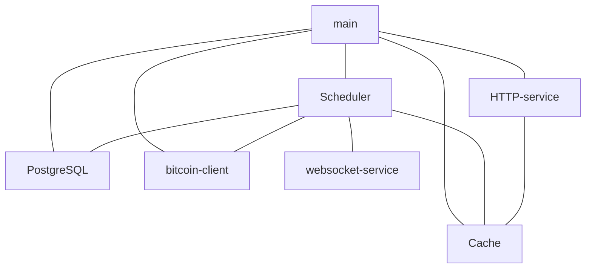
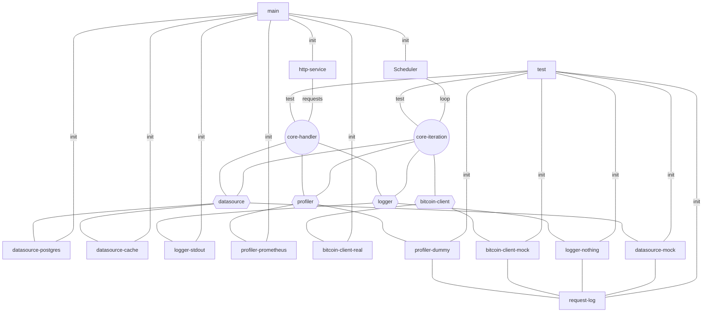

# Brief

This document contains description of the Handlers architecture approach as developmnent pattern which maybe useful for `Op-Energy`

# How to read this document

This document is using `mermaid` diagrams, so you need markdown editor/viewer which support it. It can be either:
- Obsidian
- stackedit.io
- github.com

# As is

The current architecture of the `op-energy` services (blockspan, account and blockrate services) are kind a straightforward as the goal during implementation was speed, not scaling or reproducible testing.

Blockspan service:

Blockspan service at the start: 
1. connects to DB
2. reads data from DB into Cache;
3. loads latest data and sync blocks from the bitcoin node;
4. starts HTTP server and scheduler thread

The overview of components can be represented as:

From the component diagram, we can see, for example:
- HTTP-service is not intended to use DB directly. Instead, is should Cache layer instead to serve request;
- scheduler service, in it's turn, is the place which is accessing bitcoin, updating the cache and the DB.

## Problem

There are some rare events which may appear and we should handle them somehow.
For example, bitcoin network can have a stale branch. 

But, with current approach we can't actually test if we can actually handle such event until we will witness it during actual runtime.

Another issue is that components are directly connected to each other and say, replacing HTTP and websocket interfaces with some queue base one will be a challenge. 

## Solution options

### Mocking data to a third party services

| Pros                                                                                                                | Cons                                                                                                                                                                                                                                                                       |
| ------------------------------------------------------------------------------------------------------------------- | -------------------------------------------------------------------------------------------------------------------------------------------------------------------------------------------------------------------------------------------------------------------------- |
| - There is no need to some additional test framework: system is using the same code to test some specific cases  | - we can't test bitcoin events as we can't craft blockchain manually                                                                                                                                                                                                    |
|                                                                                                                     | we still need to adapt code to have some ability to test the reaction of the system on failure events                                                                                                                                                                      |
|                                                                                                                     | the whole test infrastructure will require a test VM (well, it exist at the moment, but only to perform 1 API call), but deploying the whole VM for running multiple tests is either slow or not so isolated (if we will going to wipe DB and reapply some next test data) |
#### Mocking third-party services

if instead of trying to provide a mock data to an external services it is much more flexible to abstract third-party services and provide mock versions of such services. 

| Pros                                                                                                                                                                                                                                                                                                                      | Cons                                                                                                                                                                                                                     |
| ------------------------------------------------------------------------------------------------------------------------------------------------------------------------------------------------------------------------------------------------------------------------------------------------------------------------- | ------------------------------------------------------------------------------------------------------------------------------------------------------------------------------------------------------------------------ |
| We can provide any mocked service: bitcoin, time, database.                                                                                                                                                                                                                                                               | There are 3 places which can lead to false positives (test can pass because you can write an incorrect test or you can incorrectly assume how the real service will behave and mock service will not behave as real one) |
| to some extent, we can extend/scale system by providing additional versions of the  services. For example, cache layer can be implemented as a specific version of the DataSource service. Thus should not cause a review of the tests or core. Maybe, it will require new tests specific for this implementations though | you need to develop and support mocked versions of the services. It is not free in terms of time and effort. Tests themselves should be developed and maintained as well.                                                |
| Any event can be mocked. We can tweak: time, blockchain reorganizations, IO exceptions (for example during a DB transactions)                                                                                                                                                                                             | Some experience needed to provide a decoupled core which is flexible enough for tests and at the same time which is flexible for an actual use within app                                                                |
| No need for a separate VM: core doesn't know if it is using mocked or real external service. Our task is just to not to reuse state between multiple tests if we don't need it.                                                                                                                                           |                                                                                                                                                                                                                          |
| Tests are not a requirement. We can implement system without 'all possible tests' and either add them later or if the functionality is not the important, never cover it with tests                                                                                                                                       |                                                                                                                                                                                                                          |

# How it should be

I assume that we are going the Mocking third-party services options as it is much more flexible.

On this diagram:
1. core-iteration and core-handler are pure and only use services via pure interfaces;
2. datasource, profiler, logger, bitcoin-client are pure interfaces to appropriate services;
3. both production flow and test framework use the same pure core-iteration and core-handler;
4. test implementations of the services are writing request log, which can be analyzed during testing in order to understand, for example, if handler use profile service or if it is using only read-only datasource calls.

# Current state

State of implementation of the Handlers-architecture:

1. there is a part of pure core, which is responsible of block observation and storing their info in the database. In case if it observes block from reorganized branch, it will search for a common block of the new and stalled branch and will (re)read blocks from [common root block; latest confirmed branch] and will store it in the DB;
2. there are tests for confirmation logic;
3. there are tests for ensuring scheduler will be shutdown in case if bitcoin client will return error;
4. there is a test for ensuring that no API call modifies DB (because I was able to split read and read-write DB requests and only the scheduler thread should be using read-write requests);
5. there are tests for discovering blocks from the top of the chain (modeling filling of database after DB cleanup);
6. there are tests for discovering blocks from the bottom of the chain (modelling discovering of blocks from the start of the chain);
7. there are tests for discovering blocks from the bottom WITH reorganized blocks within 6 tip blocks;
8. there are tests for discovering blocks from the bottom WITH reorganized blocks within 6+ tip blocks;
9. there are handler-based services for: DataSource(DB), Time, Profiling, Bitcoin client, Logger, IO;
10.1. currently, only test versions of such services are implemented.
10. HTTP API is treated as one of interfaces to call a core functions making it possible to add other interfaces, like rabbitmq (for a future scaling purposes);

My latest work before stop was focused on a failed tests: it turned out that I had a bug in generating of reorganized branches (messed with timestamps in that case which caused discovering blocks in an expected time). Which brought an issue that when test failes there can be issues in:
1. core;
2. tests;
3. test implementations of service (this was a case of a test bitcoin client, which generated a reorganized branches with wrong time stamps).
# Summary thoughts

Although testing brings some slow down (as requires to implement test-focused implementations of services) and testing code itself (ie tests and test implementations) are not protected from not having their own bugs(ie, they are some costs), it still allowed me to:
1. play with mocked blockchain and check behavior of the core ;
2. understand reorganizations better (for example, initially I thought that reorganizations are quite rare events and 6-block stale branch is an exceptional case, which mean that the whole bitcoin network is in a big trouble. But it turned out that reorganizations are not so rare events. 1-block reorganizations are in fact quite often and there were 4-blocks-deep stale branch caused by network latency and 51-blocks-deep stalled branch caused by protocol update related issues in the past), which forced me to change the opinion of how such events should be treated. Basically, it turned out that 6-blocks-deep stalled branch won't cause major trouble to the network, so we should not treat it as an exceptional case as well;
3. enforce purity of the core by using Safe Haskell. Although, Handler-architecture is some kind of  interfaces from OOP world or hexagon architercture pattern, making it pure and incorporating it with Safe Haskell makes quite unique approach of policy of usage of non-pure code: you can't just use some random IO function inside a pure core. You forced to implement it as a service and this will make you thought of how should this 'random IO function' will behave in a test environment. Should it be covered with test? Or maybe you should use something already existing? For example, if you want to use Text.putStrLn to output some debug information, compiler won't allow this. In this case, you should came to a decision to use Logger service's Logger.logDebug. Ie, it is harder to add a mess into a pure core this way. This is a unique feature. Maybe Scala is able to provide the same guarantees (I am not sure).

# What are yet to be implemented

1. actual production services' implementatoins;
2. integration of part of system built with Handlers architecture as a separate API call for tests;
3. probably, it will be useful to provide an API call to find common root block of 2 branches (stale vs active branch). This call will be useful for blockrate service to rediscover possibly discovered new active branch of blocks to handle block reorganizations.

